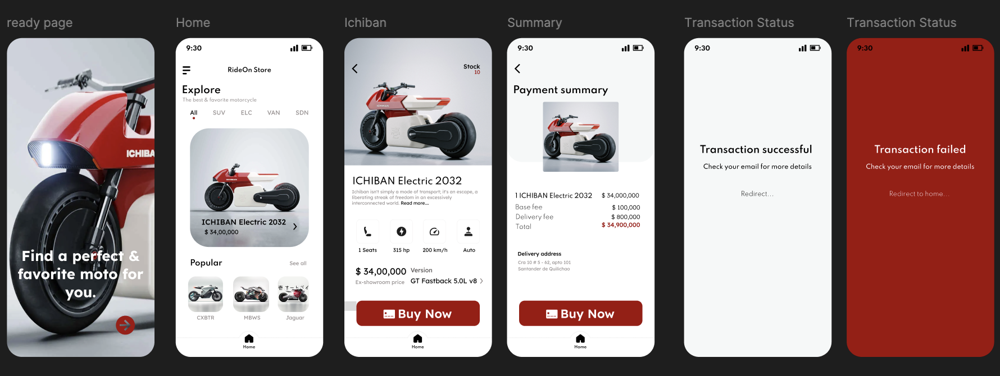

# Ride On Store - API



## Description

Ride On Store is a Single Page Application (SPA) built using the NestJS framework. This project serves as the backend for an e-commerce platform, providing RESTful APIs for managing products, orders, users, and other essential functionalities. The application leverages TypeScript for type safety and maintainability, and it is designed to be scalable and efficient, making it suitable for production environments.

[Nest](https://github.com/nestjs/nest) framework TypeScript starter repository.

<p align="center">
  <a href="http://nestjs.com/" target="blank"></a>
</p>

## Overview

### The challenge

The challenge is to provide an API for the payment process. This involves integrating with payment gateways, ensuring secure transactions, handling payment confirmations, and managing refunds. The API should be robust, scalable, and easy to integrate with the frontend of the e-commerce platform.

### Project setup

```bash
$ yarn install
```

### Compile and run the project

```bash
# development
$ yarn run start

# watch mode
$ yarn run start:dev

# production mode
$ yarn run start:prod
```

### Run tests

```bash
# unit tests
$ yarn run test

# e2e tests
$ yarn run test:e2e

# test coverage
$ yarn run test:cov
```
### Links

- Ride On Shop URL: [RideOn](https://github.com/untalinfo/space-tourism-react)
- Ride On Shop Frontend URL: [GitHub](https://github.com/untalinfo/ride-on-store)
- Ride On Shop Backend URL: [GitHub](https://github.com/untalinfo/ride-on-store-backend)

## Author

- LinkedIn - [Oscar Info](https://www.linkedin.com/in/untalinfo/)


## License

Nest is [MIT licensed](https://github.com/nestjs/nest/blob/master/LICENSE).
